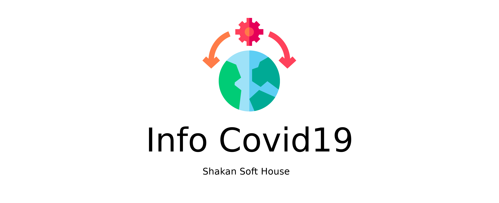
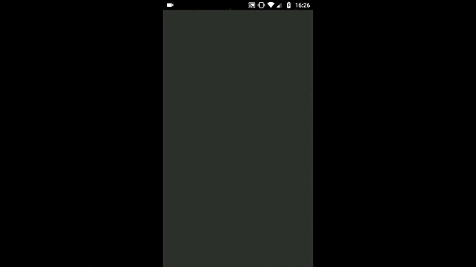

# Info Covid 19 - App to Android

  

  

## Description
Um app desenvolvido com a tecnologia [Ionic 5](https://ionicframework.com/), utilizando a API do [The Novel COVID API](https://corona.lmao.ninja/). Para se manter informado como está a situação do COVID-19 no mundo com poucos cliques. Uma interface simples com um layout agradável. Precisa de conexão à Internet para funcionar.

Este app foi desenvolvido a nível didático, foi a primeira vez que fiz um app mobile e gostei muito do resultado. Gostei também de conhecer a tech Ionic. Não subi o app na Play Store pois o primeiro pagamento está muito caro devido a alta do Dólar. Por isso disponibilizei o apk do projeto para amigos que estavam utilizando diariamente para se informarem de como está o COVID-19 ao redor do mundo.

## Download of APK
1. Clique aqui -> [App Info Covid19](https://github.com/diegoshakan/app_covid19/blob/master/src/assets/to_readme/app-info-covid19.apk)
1. E depois clique em download.

## Packages
* typescript: "~3.4.3"
* @ionic/angular: "^5.0.0"
* @angular/cli: "~8.3.23"

## Getting Started
1. Faça o download ou clone este repositório;
1. Abra seu Terminal/Prompt e navegue até o diretório app_covid19;
1. Rode: **$ npm install**;
1. Abra seu editor de código de preferência e nos ajude, altere, estude, faça o que quiser;
1. Para subir o servidor é só rodar **$ ionic server**.

## Do You Wanna Help?
* Abra uma Issue;
* Faça o fork do projeto para sua conta;
* Nosso modelo de branches é a seguinte **_feature/seu_nome-sua_feature_** *(ou hotfix, ou outra coisa)*.
